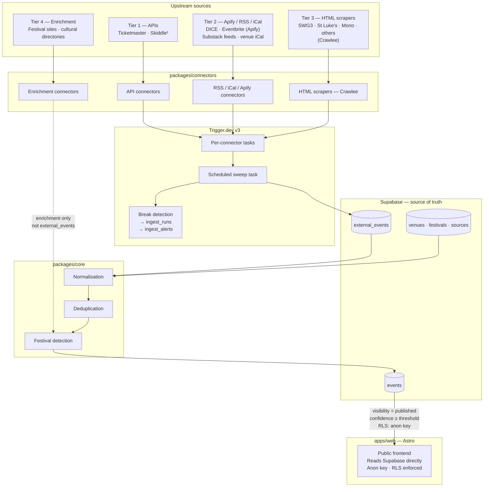

# Architecture

Clyde Culture is built engine-first. The ingestion pipeline, normalisation core, and
data model exist independently of the public frontend. The frontend is a presentation
layer that reads from Supabase directly — it is disposable and replaceable without
touching the engine.

**Frontend:** Astro + Supabase direct read, anon key scoped by RLS. See
[docs/decisions/0001-frontend-architecture.md](decisions/0001-frontend-architecture.md).

**Ingestion runtime:** Trigger.dev v3 (Node/Bun worker). See
[docs/decisions/0002-ingestion-runtime.md](decisions/0002-ingestion-runtime.md).

**Scraping strategy:** Apify/Crawlee hierarchy. See
[docs/decisions/0003-scraping-strategy.md](decisions/0003-scraping-strategy.md).

---

## Component diagram



¹ Skiddle build gated on written commercial approval (API-03).

---

## Components

### packages/connectors

The connector library contains one module per upstream source. Every connector
implements the same TypeScript interface (defined in
`packages/connectors/src/connector.ts`) with a single `run()` method that returns
a result object rather than throwing. Errors are returned, not raised, so a failing
connector cannot crash the Trigger.dev task and cannot disrupt other connectors.

Connectors are organised by source type: `api/`, `rss/`, `ical/`, `html/`, `apify/`.
Each connector is responsible for:

- Fetching raw data from its upstream source
- Extracting a stable `externalId` per record
- Capturing the `externalUrl` (required — the link-first contract)
- Writing a minimal extracted representation alongside the full raw payload

HTML connectors use **Crawlee** (`CheerioCrawler` for static pages,
`PlaywrightCrawler` for JS-rendered pages). Apify connectors call the Apify API,
trigger an actor run, poll for completion, and fetch the output dataset.

Connectors do not normalise. They write to `external_events` only.

### Trigger.dev v3

Trigger.dev replaces `packages/ingestion`. It handles:

- Daily cron trigger for the connector sweep
- Per-connector task isolation (a failing task does not affect others)
- Retries, exponential backoff, and failure alerting
- Fan-out for parallel connector runs
- Realtime run logs

Each connector's `run()` method is called inside a Trigger.dev task. The task writes
one `ingest_runs` row on start and updates it on completion. Break detection
(14-day rolling median of `parsed_count`) runs as a follow-up check inside the same
task.

### packages/core

The core package contains the three processing stages that turn raw `external_events`
into canonical `events`. The full contract is in `docs/NORMALISATION.md`.

**Normalisation** resolves extracted fields — title, datetime, venue name, event type,
tags — into the canonical schema. Venue names are matched via `resolve_venue()`; unmatched
venues are auto-created as stubs. Event type is mapped via `source_type_category_map`.
A confidence score (0–100) is assembled from source tier, field completeness, venue
resolution success, and cross-source corroboration.

**Deduplication** operates at two levels. Within a source, upsert by
`(source_id, external_id)` handles everything cleanly. Across sources, a `dedupe_key`
is computed as the SHA-256 of `venue_id | start_bucket | normalised_title`.
Candidate cross-source duplicates are held in `event_merge_candidates` for review or
auto-merge. When duplicates are confirmed, the API-sourced record is preferred as
canonical.

**Festival detection** checks each event against known festival domains, title
substrings, URL slugs, and a manual mapping table. When a match is found,
`festival_id` is attached and `is_festival_event` is set. Date-window validation
ensures an event falls within the festival's `start_date`/`end_date`.

### Supabase — source of truth

Supabase (Postgres) is the canonical data store. The frontend never writes to it
and is not the source of truth. If the frontend is destroyed and rebuilt from
scratch, no event data is lost.

Key tables:

| Table | Purpose |
|---|---|
| `external_events` | One row per upstream item; full raw payload; never modified by normalisation |
| `events` | Canonical event records; what gets queried by the frontend |
| `venues` | Evergreen venue directory |
| `festivals` | Festival reference entities with date windows |
| `sources` | Connector registry with health and config |
| `ingest_runs` | Per-run audit log for every connector execution |
| `ingest_alerts` | Break detection alerts |
| `event_merge_candidates` | Cross-source dedup candidates pending review |
| `event_submissions` | Community-submitted events in the moderation queue |
| `venue_claims` | Venue claim requests (Phase 2) |

### apps/web — Astro

The public frontend. Reads Supabase directly using the Supabase JS client and the
anon key. RLS policies enforce `visibility = 'published'` on `events` and
`status IN ('active', 'temporary')` on `venues`. The anon key is safe in the browser
because these policies are enforced at the database layer.

`packages/publishing` is removed. There is no sync job. An event becomes visible on
the frontend immediately when its `visibility` transitions to `'published'`.

Shared Supabase query helpers (typed wrappers for common queries) live in
`packages/shared` and are imported by `apps/web`.

---

## Data flow

The following traces a single event from ingest to publication.

```
1. Connector run
   Trigger.dev schedules a task for the Ticketmaster connector.
   The connector fetches events via the Ticketmaster API, extracts
   externalId (Ticketmaster event ID), externalUrl, title, start_at,
   and venue_name, and stores the full API response as raw JSON.

2. Upsert to external_events
   The task upserts by (source_id, external_id).
   If the record already exists, last_seen_at is updated; if the
   payload has changed, the diff is captured. A new record gets
   first_seen_at stamped.

3. ingest_runs log
   The Trigger.dev task writes to ingest_runs: fetched_count,
   parsed_count, upserted_external_count, errors_count, status.
   Break detection compares parsed_count to the 14-day median.

4. Normalisation (packages/core)
   The normaliser reads unprocessed external_events rows.
   venue_name is matched against venues; if no match, a stub is
   created. event_type is mapped to the taxonomy enum via
   source_type_category_map. A confidence score is assembled.
   See docs/NORMALISATION.md for the full contract.

5. Deduplication (packages/core)
   Within-source: the upsert in step 2 already handles this.
   Cross-source: the dedupe_key is computed and checked against
   existing events. If a candidate match exists above the fuzzy
   threshold, it is added to event_merge_candidates. Otherwise a
   new events row is created with visibility = 'draft'.

6. Festival detection (packages/core)
   The event's source domain, title, and URL are checked against
   festival rules. If a match is found and the event date falls
   within the festival window, festival_id is attached.

7. Moderation
   Events with confidence below threshold, or with specific
   uncertainty flags, have needs_review = true set automatically.
   A moderator reviews and approves (visibility = 'published')
   or hides the event. High-confidence Tier 1 API events may be
   auto-published.

8. Frontend query
   apps/web queries Supabase directly via the anon key.
   RLS ensures only visibility = 'published' events are returned.
   No sync job. No propagation delay.
```

---

## Monorepo layout

```
packages/shared       types, taxonomy enums, config, Supabase client, query helpers
packages/core         normalisation, deduplication, festival detection
packages/connectors   modular connector library (api/ rss/ ical/ html/ apify/)
apps/web              Astro frontend — reads Supabase directly
supabase/             migrations, edge functions, seed data
docs/                 project documentation and decision records
```

TypeScript (strict mode) throughout. pnpm workspaces. Connectors are plain TypeScript
modules behind the shared `Connector` interface — no framework coupling. The
`packages/ingestion` directory is removed; Trigger.dev replaces it.
